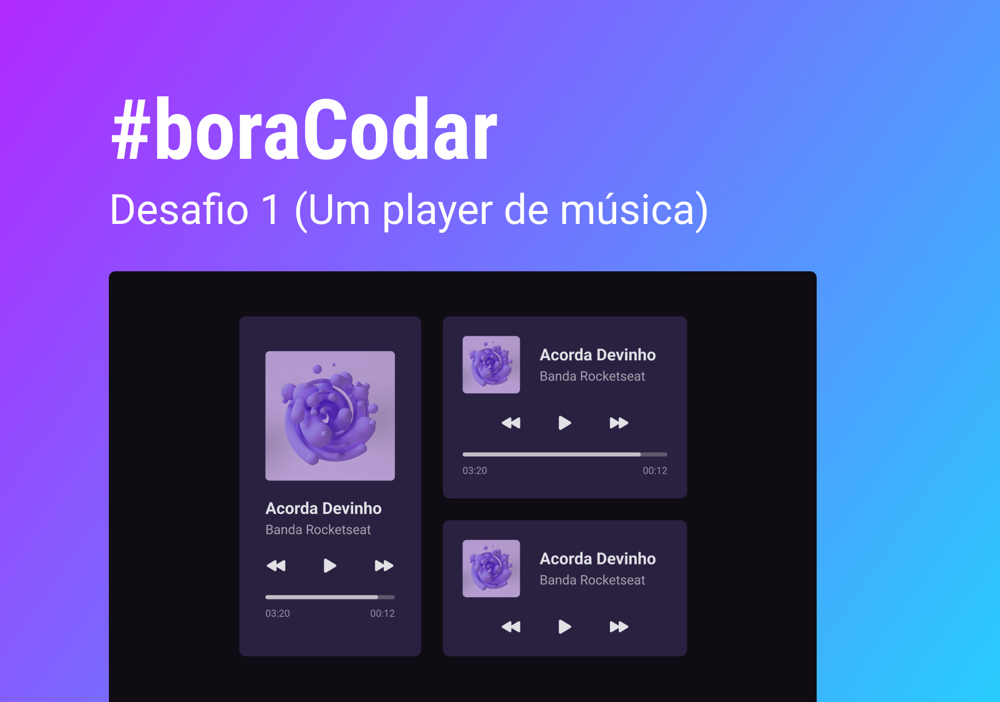

<h1>Desafio #01 - Player de musica</h1>

#boraCodar um player de música.

Instruções

  Desenvolva um player de musica seguindo o protótipo. Use sua criatividade e fique à vontade para ir além nesse projeto.

  <h2>Protótipo</h2>
  

Material Complementar

<a href="https://www.figma.com/file/qXku8DmcaibaHnXySdZnvE/%23boraCodar---Desafio-1-(Copy)?node-id=1%3A282&t=iSTSCMWH4CH7LROw-1">Acesse o material complementar, arquivo do Figma e informações sobre os assets.</a>

<h2>🔧 Tecnologias utilizadas</h2>
<ul>
  <li>HTML</li>
  <li>CSS</li>
  <li>JavaScript</li>
  <li>Figma</li>
  <li>Git e GitHub</li>
</ul>

<a href="https://devdanton.github.io/music-player/">Web page com o projeto finalizado.</a>
